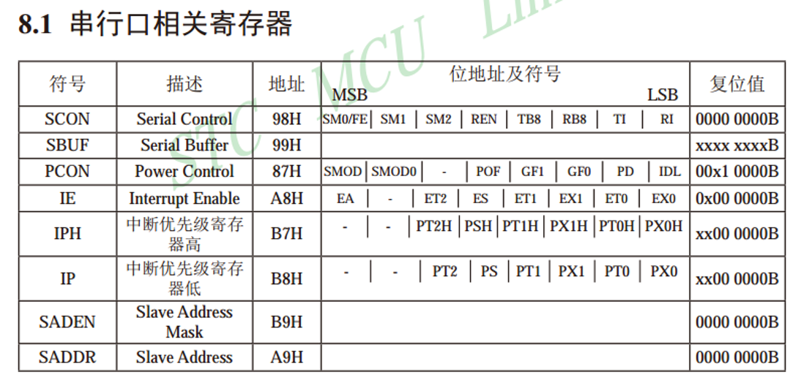

# A8串口通信

实现两设备间的互相通信

我们51单片机的串口自带UART 异步收发器,太好了喵

•简单双向串口通信有两根通信线（发送端TXD和接收端RXD）

•TXD与RXD要交叉连接

•当只需单向的数据传输时，可以直接一根通信线

•当电平标准不一致时，需要加电平转换芯片

VGA连VGA  穿视频

VCC连VCC 传 XXXX

•电平标准是数据1和数据0的表达方式，是传输线缆中人为规定的电压与数据的对应关系，串口常用的电平标准有如下三种：

•

•TTL电平：+5V表示1，0V表示0 近 10多米

•RS232电平：-3~-15V表示1，+3~+15V表示0  近 10多米

•RS485电平：两线压差+2~+6V表示1，-2~-6V表示0（差分信号）穿的最远,1000米

•全双工：通信双方可以在同一时刻互相传输数据

•半双工：通信双方可以互相传输数据，但必须分时复用一根数据线

•单工：通信只能有一方发送到另一方，不能反向传输

•

•异步：通信双方各自约定通信速率

•同步：通信双方靠一根时钟线来约定通信速率

•

•总线：连接各个设备的数据传输线路（类似于一条马路，把路边各住户连接起来，使住户可以相互交流）

| 名称     | 引脚定义              | 通信方式   | 特点      |
| ------ | ----------------- | ------ | ------- |
| UART   | TXD、RXD           | 全双工、异步 | 点对点通信   |
| I²C    | SCL、SDA           | 半双工、同步 | 可挂载多个设备 |
| SPI    | SCLK、MOSI、MISO、CS | 全双工、同步 | 可挂载多个设备 |
| 1-Wire | DQ                | 半双工、异步 | 可挂载多个设备 |

•STC89C52有1个UART

•STC89C52的UART有四种工作模式：

  模式0：同步移位寄存器

  模式1：8位UART，波特率可变（常用）

P3.0口  RXD

P3.1口 TXD

•波特率：串口通信的速率（发送和接收各数据位的间隔时间）

•检验位：用于数据验证  奇偶校验  

•停止位：用于数据帧间隔

•HEX模式/十六进制模式/二进制模式：以原始数据的形式显示

•文本模式/字符模式：以原始数据编码后的形式显示

### 代码1

//配置串口

SCON  串行控制寄存器 

配置函数 UART_Init()

PCON 波特率选择特殊功能寄存器 

### 代码2

